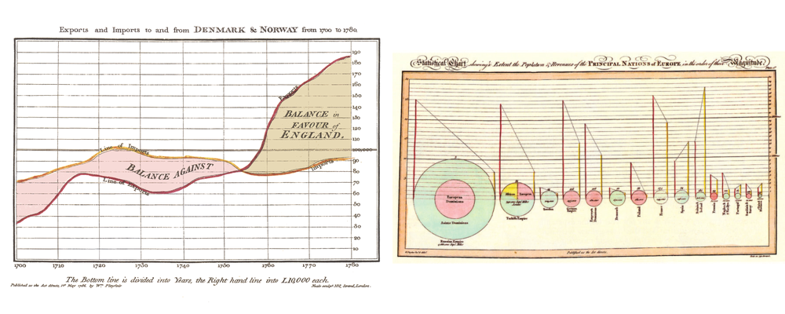
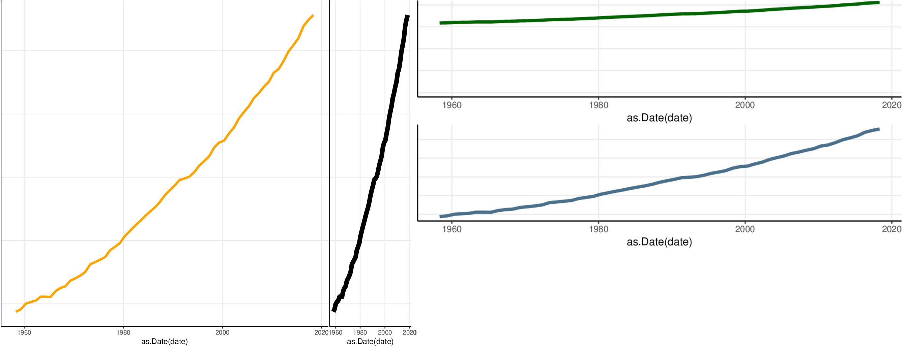
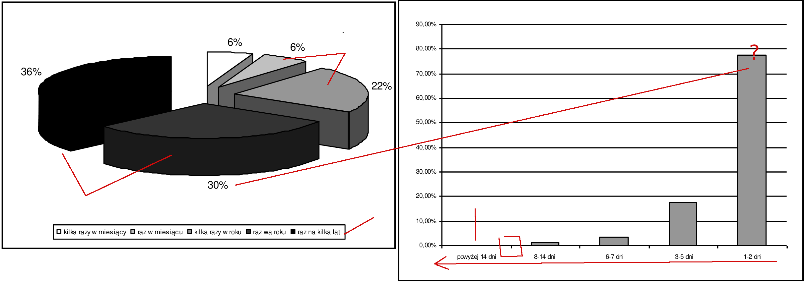

## Why it is important to know the rules of statistical charts

**Lies, damned lies, and statistics**

The above quotation is attributed to Benjamin Disraeli (UK Prime Minister)

Fake news hype. Numbers disguised as a result of a statistical analysis are often used to persuade
something to somebody. Statistical charts are ubiquitous now and many of them are fake...

Why people believe in numbers uncritically? They believe as they are **innumerate**. 
Why people are innumerate? 

People are illiterate because they failed to learn how to read and write. 
Simple...

Perhaps people are innumerate
not because of **genetic load** or some other disaster,
but simply becuase they are not educated.

Five stages of statistical data analysis:


Usually students' attention is concentrated on stages 2 and 3 almost exclusively. 
In result statistics is regarded as part of math
thus 100% reliable while in reality it is not. 
Stages 1 and 5 are often **more of an art than a science** and if one do not know
the rules of these stages one can easily put excessive trust in the final outcome.

**Less theory, more practice, and common sense**.

## What are statistical charts for?

Statistical charts can be plotted for the following three purposes:

* **Decoration** (to attract somebodys' attention, document without pictures looks dull,
color pictures are better than back-white ones, fanciful drawings are better than simple ones,
*form is the king and content does not matter*)

* **Explanation** (to better explain some phenomenon to somebody. It is claimed that a picture is worth
thousand of words in this context)

* **Exploration** (looking for data patterns at the exploratory stage of data analysis)

A visual-art designer not statistician is a right person for the 1st purpose. I am not an art-designer
so I will not tell you how to prepare eye-catching pictures. I am a statistician and I will
concentrate on *effective* graphical methods for statistical explanation/exploration. 
And by *effective* I mean that one (graphical) method  is more effective than another if its quantitative
information can be decoded more quickly/easily [Robbins 2005]

## Types of charts

Some graphs are better than others:

* **Recommended**: (ordered) dot plots, bar charts, lineplots, histograms and kernel
density estimates, stripcharts,
multipanel displays (instead of stacked bars multiple line/dot plots)
scatterplots (two variables)

* **Not recommended**: Pie charts, bubble charts, stacked bar charts,

Note: bar/line/pie charts were introduced by William Playfair in XVIII century.
Dot plots were introduced by John Cleveland (1980s).
Box-plots were introduced by John Tukey (1970s)



More Playfair's charts can be found via google or in
[Syamnzik's paper](http://www.math.usu.edu/symanzik/papers/2009_cost/editorial.html)


## Pie charts, dot plots and histograms

Nights spent at tourist accommodation establishments by non residents (tour_occ_ninat)


```{r message=F, echo=F, warning=F}
library(ggplot2)
library("dplyr")
library(RColorBrewer)
library(ggpubr)

# https://www.datanovia.com/en/blog/how-to-create-a-pie-chart-in-r-using-ggplot2/
df <- data.frame( class=c("Spain", "UK", "Italy", "France", "Greece",
    "Austria", "Germany", "Croatia", "Portugal", "Netherlands", "Rest28"),
    n=c(305907462, 213378155, 210658786, 133499991, 89284386, 86044321, 83111219,
        80176804, 48884842, 44169041, 202635615));

sum.eu <-sum(df$n)
df["prop"] <- df$n / sum.eu * 100;
df["txt.prop"] <- sprintf ("%.1f", df$prop);

df <- df %>%
  arrange(desc(class)) %>%
  mutate(ypos = cumsum(prop) - 0.5*prop)

mycols <- brewer.pal(13, "Set3")

pc1 <- ggplot(df, aes(x = "", y = prop, fill = class)) +
  geom_bar(width = 1, stat = "identity", color = "white") +
  coord_polar("y", start = 0)+
  scale_fill_manual(values = mycols) +
  theme_void()

pc2 <- ggplot(df, aes(x = "", y = prop, fill = class)) +
  geom_bar(width = 1, stat = "identity", color = "white") +
  coord_polar("y", start = 0)+
  geom_text(aes(y = ypos, label = txt.prop), color = "black")+
  scale_fill_manual(values = mycols) +
  theme_void()

## dot-plot
pc3 <- ggplot(df, aes(x = reorder(class, n) )) +
  geom_point(aes(y = prop, colour = 'prop' ), size=3) +
  xlab(label="#") + ylab(label="% ") + coord_flip()+
  ggtitle("Share of...") +
  theme(plot.title = element_text(hjust = 0.5))

## bar chart
pc4 <- ggplot(df, aes(x = reorder(class, n), y=prop, fill=prop )) +
  geom_bar(stat="identity", color = 'blue' ) +
  xlab(label="#") + ylab(label="% ") +
  coord_flip()+ ggtitle("Share of...") +
  theme(plot.title = element_text(hjust = 0.5))

ggarrange(pc1, pc2, pc3, pc4, ncol = 2, nrow = 2)
```

## NUTS and TERYT

The Nomenclature of Territorial Units for Statistics (NUTS)
is a geocode standard for referencing the subdivisions of countries for statistical purposes.
The standard is developed and regulated by the European Union, and thus only covers the member states of the EU in detail (cf [NUTS](https://en.wikipedia.org/wiki/Nomenclature_of_Territorial_Units_for_Statistics))

NUTS *standard* was revised several times (on the average every 4 years :-)), so there is even a page 
at ec.europa.eu domain dedicated to NUTS (short) history (cf 
[NUTS history](https://ec.europa.eu/eurostat/documents/345175/501899/Nuts-history))


NUTS1 (level) -- macroregion, NUTS2 -- state, NUTS3 -- subregion (several counties in case of Poland)

Poland is divided into *7 macroregions*,  *16 states (NUTS2)*, and 72
subregions (NUTS3).

NUTS1 level is only for statistical purposes (but regions are in fact
distinct due to history, economics, natural-conditions, cultural factors etc... )

There is a relevant and interesting page by GUS (Main Statistical Office or Główny Urząd Statystyczny),
but unfortunately in Polish (use google translate :-) in case you are interested or mail me)
(cf [Klasyfikacja NUTS w Polsce](https://stat.gov.pl/statystyka-regionalna/jednostki-terytorialne/klasyfikacja-nuts/klasyfikacja-nuts-w-polsce/) )


The above map shows 7 macroregions (NUT1) and 16 provinces (NUTS2).
BTW province in Polish is "prowincja" (due to both are from Latin) but actually 
Polish administrative provice is called "województwo", from "wodzić" -- ie commanding (the armed 
troops in this context).  This is an old term/custom from the 14th century, 
where Poland was divided into provinces (every province
ruled by a "wojewoda" ie chief of that province). More can be found
at Wikipedia (cf [Administrative divisions of Poland](https://en.wikipedia.org/wiki/Administrative_divisions_of_Poland))

NUTS3 consists of 380 counties grouped into 72 subregions.

A Polish county (called "powiat") is 2-nd level administrative unit. 

In ancient Poland powiat was called
"starostwo" and the head of a "starostwo was called "starosta". "Stary" means Old, so
"starosta" is an old (and thus wise) person. 
BTW the head of powiat is "starosta" as 600 years ago:-)


The 3rd level administrative unit is called "gmina" (community). 

There are (approximately) 380 counties and 2750 communities in Poland. 

As Poland population is 38,5 mln and the area equals 312,7
sq kilometers (120 persons per 1 sqkm) on the average each powiat has 820 sqkm and each community
has 113.5 sqkm or approximately 100 thousand persons per "powiat and 14 thousand per "gmina".

**TERYT** is a Polish NUTS (developed some 50 years ago). It is complex system which includes
identification of administrative units. Every unit has (up to) a 7-digit id number: wwppggt
where ww = "województwo" id, pp = "powiat" id, gg = "gmina" id and "t" decodes type-of-community
(rural, municipal or mixed). Higher units has trailing zeros for irrelevant part of id, so
14 or 1400000 means the same; as well as 1205 and 1205000. Six numbers is enough to identify
a community (approx 2750 units).

So you are now experts on administrative division of Poland, and we can
go back to statistical charts...


## Strip charts

A strip chart (strip plot) shows *the distribution* of data points along
a numerical axis.These plots are suitable compared 
to box plots when sample sizes are small (because preserve more information about the data).

Example: Number of hotels in powiat by region (NUTS1, 2017):

```{r, cache = F, echo=F, dependson = "pl_hotel_data"}
d <- read.csv("powiaty_wskazniki_woj_regiony.csv", sep = ';',  header=T, na.string="NA");
d$wteryt <- as.factor(d$wteryt)

p4<-ggplot(d, aes(x=nuts1, y=hotele2017)) +
   geom_jitter(position=position_jitter(0.0), cex=.2)
p3<-ggplot(d, aes(x=nuts1, y=hotele2017)) +
  geom_point(alpha = 1/20)
  #geom_point(size = .3)
  #geom_jitter(position=position_jitter(0.05), cex=1.2)
ggarrange(p4,p3, ncol = 2, nrow = 1)
```

The biggest potential problem with a dot/scatterplot is overplotting: 
whenever one has more than a few points, points may be plotted on top of one another. 
This can severely distort the visual appearance of the plot (left panel)

There is no one solution to this problem, but there are some techniques that can help: 
use smaller dots, use semi-transparent dots (right panel), use jitter.

Jitter---a small random noise added to data, is shown below
(higher jitter on the right panel)

```{r, cache = F, echo=F, dependson = "pl_hotel_data"}
p1<-ggplot(d, aes(x=nuts1, y=hotele2017)) +
   geom_jitter(position=position_jitter(0.2), cex=.2)
p2<-ggplot(d, aes(x=nuts1, y=hotele2017)) +
   geom_jitter(position=position_jitter(0.1), cex=.2)
ggarrange(p2,p1, ncol = 2, nrow = 1)
```

## Histograms and kernel density functions

Histograms show the distribution of a set of data. To draw a histogram
the numbers (observations) are grouped
into bins (intervals or classes). There is
a trade-off between showing details or showing an overall picture.
When bin width changes the scale at Y-axis changes as well (more bins less
observations in each bin). Example number of hotels in Poland (2017):

```{r, cache = F, dependson = "pl_hotel_data"}
ggplot(d, aes(x = hotele2017)) +
  geom_histogram(bins = nclass.Sturges(d$hotele2017))
```

Histograms with binwidth equal to 20, 10, 5 and 1 respectively:

```{r, cache = F, echo=F, dependson = "pl_hotel_data"}
#library(ggpubr)
p1 <- ggplot(d, aes(x = hotele2017)) +
  geom_histogram(binwidth = 20)
p2 <- ggplot(d, aes(x = hotele2017)) +
  geom_histogram(binwidth = 10)
p3 <- ggplot(d, aes(x = hotele2017)) +
  geom_histogram(binwidth = 5)
p4 <- ggplot(d, aes(x = hotele2017)) +
  geom_histogram(binwidth = 1)

ggarrange(p1,p2,p3,p4)
```


Drawback of histogram: scale is bin (width) dependent.

Kernel density functions

```{r, cache = F, echo=T, dependson = "pl_hotel_data"}
ggplot(data=d) + geom_density(aes(x=hotele2017))
```

```{r, cache = F, echo=T, dependson = "pl_hotel_data"}
p1 <- ggplot(data=d) + geom_density(aes(x=hotele2017), adjust=0.25)
p2 <- ggplot(data=d) + geom_density(aes(x=hotele2017), adjust=1.0)
p3 <- ggplot(data=d) + geom_density(aes(x=hotele2017), adjust=2.0)
p4 <- ggplot(data=d) + geom_density(aes(x=hotele2017), adjust=8.0)
ggarrange(p1,p2,p3,p4)
```

## Comparing distributions: box-plots

Box-plots are much better than histograms for comparing distributions
of more than one data sets.

Construction of a (typical) box-plot: The middle bar is a median. Top/bottom
bars of the rectangle shows the IQR (interquartile range is 1st and 3rd\
quartile), the fanciful bars above/below rectangle called whiskers
(google: whiskers mustache :-) are 1,5 times the IQR (or minimu/maximum if
those values are  less than plus/minus 1,5 IQR.
The symbols above/below whiskers (usually open circles)
are outliers (non typical/extreme values)

Note the trick: outliers are defined not as (for example) top/botom
1% fraction of values (every distribution would has outliers in such a case)
but as values less/more than Me - 1,5IQR (distributions with medium
variablity would not have outliers)

Example: age of Nobel-prize 
winners (cf [The Nobel Prize API Developer Hub](https://nobelprize.readme.io/))

```{r, cache = F, echo=T }
nlf <- read.csv("nobel_laureates3.csv", sep = ';', dec = ",",  header=T, na.string="NA");

ggplot(nlf, aes(x=category, y=age, fill=category)) + geom_boxplot() + ylab("years") + xlab("");
```


## Comparing distributions box-plots vs multiple histograms

Number of hotels in powiat by województwo (2017):

```{r, cache = F, echo=F, dependson = "pl_hotel_data"}
p3<-ggplot(d, aes(x=wteryt, y=hotele2017)) +
   geom_jitter(position=position_jitter(0.05), cex=.3)
p4<-ggplot(d, aes(x=wteryt, y=hotele2017)) +
   geom_jitter(position=position_jitter(0.0), cex=.3)
ggarrange(p4,p3, ncol = 2, nrow = 1)
```

More jitter:

```{r, cache = F, echo=F, dependson = "pl_hotel_data"}
p2<-ggplot(d, aes(x=wteryt, y=hotele2017)) +
   geom_jitter(position=position_jitter(0.1), cex=.3)

p1<-ggplot(d, aes(x=wteryt, y=hotele2017)) +
   geom_jitter(position=position_jitter(0.2), cex=.3)
ggarrange(p2,p1, ncol = 2, nrow = 1)
```

Boxplots are better:

```{r, cache = F, echo=F, dependson = "pl_hotel_data"}
p5 <- ggplot(d, aes(x=wteryt, y=hotele2017, fill=wteryt)) + geom_boxplot() + ylab("#") + xlab("");

p6 <- ggplot(d, aes(x=wteryt, y=hotele2017, fill=wteryt)) + geom_boxplot(outlier.shape=NA) + ylab("#") + xlab("") +
      coord_cartesian(ylim = c(0, 25)) +
      theme(legend.position="none")
ggarrange(p5,p6,ncol = 2, nrow = 1)
```

## Scatter-plots

A scatter-plot (aka scatter diagrams, xyplot) is a basic
form used for two (quantitative) variables.

To see the relationship between variables, a line is can be fitted.
Least square (LS) line which assumes linear relationship
between variables, is fitted by minimizing the sum of squares of the residuals
(residual is the difference between
a data-point and a relevant line-point ie a point computed from the formula
y = a +bx where x is the value of the x-axis variable.)

(Almost) each part of Poland is attractive for tourists, but those counties which are at the seaside (north) 
or in the mountains (*south*) are special. There are 11 counties at the seaside (morze = sea)
and 18 in the mountains (*góry*):


```{r, cache = F, echo=F, warning=FALSE}
d <- read.csv("powiaty_hotele_caloroczne_turysci_2017M.csv", sep = ';',  header=T, na.string="NA");

d <-  subset(d, (y2017 > 0 ))
dd <- d;

m <- subset(dd, (teryt %in% c("3263", "3207", "3205", "3208", "3209", "3213", "2212", "2208", "2215", "2211", "2210")));
# szacujemy prosty model trendu
lm <- lm(data=m, tz2017 ~  y2017 ); summary(lm)
otherc <- coef(lm);
# W tytule średnia/mediana i równanie trendu
title <- sprintf ("Hotels vs foreign tourists morze 2017 (y = %.2f x + %.1f)", otherc[2], otherc[1] );
q0h <- ggplot(m, aes(x=y2017, y=tz2017)) + geom_point() +
 ggtitle(title) +
 geom_smooth(aes(x = y2017, y=tz2017, colour="tz2017"), method="lm", size=.5)

m <- subset(dd, (teryt %in% c("1801", "1821", "1817", "1807",
  "1805", "1205", "1210", "1211", "1217", "1215", "2417", "2403", "0208", "021", "0206", "0212")));
# szacujemy prosty model trendu
lm <- lm(data=m, tz2017  ~ y2017 ); summary(lm)
otherc <- coef(lm);
# W tytule średnia/mediana i równanie trendu
title <- sprintf ("Hotels vs foreign tourists góry 2017 (y = %.2f x + %.1f)", otherc[2], otherc[1] );
q1h <- ggplot(m, aes(x=y2017, y=tz2017)) + geom_point() +
 ggtitle(title) +
 geom_smooth(aes(x = y2017, y=tz2017, colour="tz2017"), method="lm", size=.5)

# Loess

m <- subset(dd, (teryt %in% c("3263", "3207", "3205", "3208", "3209", "3213", "2212", "2208", "2215", "2211", "2210")));
title <- sprintf ("Weekly for %s # (y = %.2f x + %.1f)", "", otherc[2], otherc[1] );
q2h<- ggplot(m, aes(x=y2017, y=tz2017)) + geom_point() +
 ggtitle("Hotels vs foreign tourists morze 2017") +
 geom_smooth(aes(x = y2017, y=tz2017, colour="darkblue"), method="loess", size=.5)

m <- subset(dd, (teryt %in% c("1801", "1821", "1817", "1807",
  "1805", "1205", "1210", "1211", "1217", "1215", "2417", "2403", "0208", "021", "0206", "0212")));
q3h<- ggplot(m, aes(x=y2017, y=tz2017)) + geom_point() +
 ggtitle("Hotels vs foreign tourists 2017 (góry)") +
 geom_smooth(aes(x = y2017, y=tz2017, colour="darkblue"), method="loess", size=.5)


ggarrange(q0h,q1h, ncol = 2, nrow = 1)
```

So each new hotel in the mountains on the average would attract 961.6 foreign tourists,
while a new hotel at the seaside would attract
5838 foreign tourists (and both numbers are statistically significant at $\alpha=0.05$:-) )


Alternatively loess curve can be used which do not assumes linearity but is parameters
are not interpretable.

```{r, cache = F, echo=F, warning=FALSE}
ggarrange(q2h,q3h,ncol = 2, nrow = 1)
```

## Scales

Logarithmic scale makes it possible to plot values with too
wide range for a linear scale. Base 10 logarithms `squeeze' the numbers
more than base 2 logarithms (log10(100)=2 wile log2(100)=6.64.
Moreover if the original scale contains multiplications of 10 use
log10 to get `nice' log-scale while it
contains multiplications of 2 use log2.

Logarithms transforms additive scale to `multiplicative' one. Example (Nobel prize again):

```{r, cache = F, echo=T }
dA <- read.csv("nobel_laureates3.csv", sep = ';', dec = ",",  header=T, na.string="NA");
nrow(dA)
dS <-  subset(dA, (! bornCountryCode == "" )) # by country of birth
nrow(dS) # how many
```

aggregate by bornCountryCode

```{r, cache = F, echo=F }
u <- table(dS$bornCountryCode)
uf <- as.data.frame(u)
```
Finally plot the resulting data using various Y-axis scales (arithmetic, log2 and log10)

```{r, cache = F, echo=F }
names(uf)[1] = 'country'

lFreq <- log2(uf$Freq)
uf["lfreq"] <- lFreq
pc3 <- ggplot(uf, aes(x = reorder(country, Freq) )) +
  geom_point(aes(y = Freq, colour = 'Freq' ), size=1) +
  xlab(label="cc") + ylab(label="n ") + coord_flip()+
  ggtitle("Number of Nobel laureates by Country") +
  theme(axis.text = element_text(size = 7)) +
  theme(plot.title = element_text(hjust = 0.5))
pc4 <- ggplot(uf, aes(x = reorder(country, lfreq) )) +
  geom_point(aes(y = lfreq, colour = 'lfreq' ), size=1) +
  xlab(label="cc") + ylab(label="log(n) ") + coord_flip()+
  ggtitle("Number of Nobel laureates by Country") +
  theme(axis.text = element_text(size = 7)) +
  theme(plot.title = element_text(hjust = 0.5))

llFreq <- log10(uf$Freq)
uf["llfreq"] <- llFreq

pc5 <- ggplot(uf, aes(x = reorder(country, llfreq) )) +
  geom_point(aes(y = llfreq, colour = 'lfreq' ), size=1) +
  xlab(label="cc") + ylab(label="log(n) ") + coord_flip()+
  ggtitle("Number of Nobel laureates by Country") +
  theme(axis.text = element_text(size = 7)) +
  theme(plot.title = element_text(hjust = 0.5))

ggarrange(pc3, pc4, pc5, ncol = 3, nrow = 1);
```

The exact figures are as follows:

```{r cache = F, echo=F }
u
```

## Graphic features 

Vizualize data = encode the quantitative information using **graphic features** (shapes, angles, colors, position, etc.). Some features are better than others...

From the best to the worst (William S. Cleveland and Robert McGill *Graphical Perception: Theory, Experimentation, and Application to the Development of Graphical Methods*, JASA 1984):

* Position along common scale

* Position along common but nonaligned scales

* Length

* Angle (slope)

* Area

* Volume

* Color (hue), Color (saturation), Color (density of black)

Angle judgement is not precise. Acute angles are underestimated
while obtuse angles (greater than 90) are  overestimated.

Area judgement is biased as well. It is impossible to distinguish
small differences in area, while quite easy when the same date
is plotted along common scale

The most accurate of graphic task is 
positioning along common scale

## General design rules

* Clear content: Reader/receiver/consumer clearly *understands* what is graphed:
scales/labels/explanations are provided (remember what/when/where?) 

* Clear form: reader/receiver/consumer clearly sees what is graphed
(no cluttered lines, overlapping elements, etc...)


* Emphasize the data not grids, labels or pointless arrows. The simpler
the better, leave complicated designs for professionals. For example
use gray not black ink (default in Excel) for grid lines 

* Tick marks and axis labels should be placed outward. X-axis values increase
always from left to the right, Y-axis values from the bottom to the top
**never** in reverse direction. Do not overdo the number of tick marks.

* Preparing color chart think how it will look like when reproduced in B-W
(xerox) or half-size or less (smartphone). 
It is important particularly in electronic print.

* Never use **more** graphic feature than your data set has dimensions.
For univariate analysis use length or color not both for example.
(Well rare exceptions to this rule are allowed)

* Pseudo 3D charts for 2D data should be forbidden as well and without
any exception. Virtually no-one can read them. 

* Use a common baseline wherever possible. Use optimum aspect ratio (banking to 45, see below). Use logaritmic scales when data range is huge, do not break
scales and generally always include 0 in numerical 
axes (not 100% obligatory however.) 
Do not (generally) use double axes.

* Prefer direct labels over using separate legend. Separate legend
forces the reader to look back and forth when studying the graph.
Of course if there is no room for (long) labels use legend.

* Multiline graphs generally are bad idea (different scales, clutter,
difficulty with assessing the difference between lines)

* Do not use crappy software which do not produces charts in proportion to data

## Edward Tufte's rules

Tufte who is a renown expert on Information Visualization (aka **guru**) coined two popular
rules: (high) data to ink ratio and a lie-factor.

Ink in this definition  refers to non-erasable ink used for 
the presentation of data. If data-ink would be removed from the image, the graphic would lose the content. Non-Data-Ink is accordingly the ink that does not transport the information but it is used for scales, labels and edges.

Good graphics should include only data-Ink. Non-Data-Ink is to be deleted everywhere where possible. The reason for this is to avoid drawing the attention of viewers of the data presentation to irrelevant elements. There is an
short an excellent video clip at YouTube which illustrates this rule.

[Data to Ink Ratio](https://www.youtube.com/watch?v=JIMUzJzqaA8)

Lie factor (LF) is a ratio as well but defined as size of the effect shown in graphics
to the size of effect in data. Preferaby LF should equal 100%. According
to Tufte, LF greater than 1.05 or less than 0.95 signals significant
distortion. This rule can be best explained with an example.

## Lie factor example

This *giant guy* (GG) in the middle is our _ex-president_. The guy next to him on the left
is our *current president* Duda. Next to Duda is ex-rock star Kukiz, dark-horse of the elections.
This is the cover (slightly modified) 
of influential polish weekly magazine form May 2015, shortly before elections.

The figures are claimed to be in-sync with the recent survey results (sort of a barchart). 
Could you figure-out from that chart about the proportion of scores of each candidate?
How much the giant-guy outperforms the runner-up candidate? Which candidate is supported
by this influential magazine (easy:-)?


The lie-factor details:


The line from shoes to top of the head equals (at certain size of course) 204mm for GG, 134mm for Duda
and 42.5mm for ex-rock star. 
So $204/134=1.5$ and $204/42.5 \approx 4.8$. As $44/29 \approx 1.5$
and $44/9 \approx 4.8$ as well formally the lieFactor is perfect. 
But should one compares lengths or areas?

If one compares **areas** not heights, one get significantly different (and correct)
results, namely: $(204 * 58) /(134 * 21)= 4.20$ and $(204 *58)/(42.5 *15) \approx 18.56$. Lie factor
is $4.2/1.5 =280$% and $18.56/4.8=387$% respectively. Huge distortion

Moreover two more tricks were applied to boost GG. Can you see them?

BTW: the text in the pink frame claims: "figure ratios are consistent with april-may survey outcome.""
(But what exactly *figure ratios* means?)

## Banking to 45

The ratio between the width and the height of a rectangle is called
its aspect ratio.

The aspect ratio describes the area that is occupied by the data in
the chart. A change in aspect ratio changes the perception
of the graph. The question is which aspect ratio is the best.

We can recognize change  most easily if absolute slopes
equals to 45 degree angle on the graph. It is much
harder to see change if the curves are nearly horizontal/vertical.
The idea (Cleveland, 1988) behind banking is therefore to adjust
the aspect ratio of the entire plot in such a way that most slopes are
at an approximate 45 degree angle.

Setting the aspect ratio so that the average of the values of the
orientations is 45 degrees is called "banking the average
orientation to 45 degrees".

Setting the aspect ratio so that the weighted mean of line segments
(weighted by segments' length is approx 45 degrees is called average
weighted orientation method (to 45 degrees).

**Exercise**: assess which slope is the steepest one and which is the smallest one?

{width=60%}

BTW: every chart presents the same data 
on CO2 emission (average for May each year) 
as provided by US Government's Earth 
System Research Laboratory, Global Monitoring Division. 
(cf [CO2 PPM - Trends in Atmospheric Carbon Dioxide](https://datahub.io/core/co2-ppm))


## Crusaders, Knights and Malbork castle

First short explanation about the subject of the analysis ie
famous Castle of the Teutonic Order in Malbork which is enlisted at UNESCO heritage list
(cf [UNESCO heritage list](https://whc.unesco.org/en/syndication) ):

Several religious military orders were formed in the Holy Land during the Crusades
Templars, Hospitallers, Teutonic Knights

The Teutonic Knights or the Teutonic Order of the Hospital of St. Mary
in Jerusalem, were known in Poland as *Krzyżacy* on account of the black
cross they wore on their white coats. 

{width=33%}

Established in 1190 to protect
German pilgrims in the Holy Land, the order was later transformed in
order to fight heretics.

In 1226 the Teutonic Knights came to Poland, invited by
Duke Konrad I of Mazovia to fight with the annoying pagan Prussian tribes
invading Poland from time-to-time from the north.
Teutonic Knights conquered Prussia, exterminated the locals and founded a powerful 
state with Malbork (Marienburg or Mary's castle in German) as its capital.

## Example of a very bad graphs

There is a research, peer-reviewed paper on tourist traffic in the castle's museum of Malbork

[The determinants of the tourist traffic
 in the castle's museum of Malbork](http://www.ojs.ukw.edu.pl/index.php/johs/article/view/4119/pdf)

Unfortunately all charts in this paper contains elementary errors. Could you identify them?

{width=75%}

{width=75%}


```{r, cache = F, echo=F, warning=FALSE, error=FALSE}
#library(ggplot2)
#library(RColorBrewer)
#library(dplyr)
#library(ggarrange)

df <- data.frame( visit.freq=c("every few years", "once a year", "every few months", "once a month", "every few weeks"),
n=c(36,30, 22, 6, 6))

colors <- brewer.pal(10, "Set1");
df["label"] <- sprintf ("%.1f", df$n);

df <- df %>%
  arrange(desc(visit.freq)) %>%
  mutate(ypos = cumsum(n) - 0.5*n)

px1 <- ggplot(df, aes(x = "", y = n, fill = visit.freq)) +
  geom_bar(width = 1, stat = "identity", color = "white") +
  coord_polar("y", start = 0)+
  geom_text(aes(y = ypos, label = label), color = "black", size=3)+
  scale_fill_manual(values = colors, name="Frequency") +
  theme_void()

px2 <- ggplot(df, aes(x = reorder(visit.freq, n), y=n)) +
  geom_bar(stat="identity", fill = 'steelblue' ) +
  xlab(label="#") +
  ylab(label="% ") +
  coord_flip()+
  geom_text(aes(label=n), hjust=1.6, color="white", size=3.0)+
  ggtitle("Frequency...") +
  theme(plot.title = element_text(hjust = 0.5))

dg <- data.frame( visit.freq=c("1--2", "3--5", "6--7", "8 and more"),
n=c(78.9, 18.0, 2.1, 1.0))
dg["lab"] <- sprintf ("%.1f", dg$n);

dg <- dg %>%
  arrange(desc(visit.freq)) %>%
  mutate(ypos = cumsum(n) - 0.5*n)

px88 <- ggplot(dg, aes(x = "", y = n, fill = visit.freq)) +
  geom_bar(width = 1, stat = "identity", color = "white") +
  coord_polar("y", start = 0)+
  geom_text(aes(y = ypos, label = lab), color = "black", size=3)+
  scale_fill_manual(values = colors, name="Frequency") +
  theme_void()

px9 <- ggplot(dg, aes(x = reorder(visit.freq, n), y=n)) +
  geom_bar(stat="identity", fill = 'orange' ) +
  xlab(label="#") +
  ylab(label="% ") +
  coord_flip()+
  geom_text(aes(label=lab), hjust=-.3, color="darkgreen", size=3.0)+
  ggtitle("Length of stay (days)") +
  theme(plot.title = element_text(hjust = 0.5))

dh <- data.frame( visit.freq=c("guestrooms", "family", "camping", "hostel", "hotel", "guesthouse"),
      n=c(48.0, 23, 11, 9.0, 5.4, 3.6))

dh["lab"] <- sprintf ("%.1f", dh$n);

px3<-ggplot(dh, aes(x = reorder(visit.freq, n), y=n)) +
  geom_bar(stat="identity", fill = 'orchid2' ) +
  xlab(label="#") +
  ylab(label="% ") +
  coord_flip()+
  geom_text(aes(label=lab), hjust=-.1, color="darkgreen", size=3.0)+
  ggtitle("Type of accomodation") +
  theme(plot.title = element_text(hjust = 0.5))


px4<-ggplot(dh, aes(x = reorder(visit.freq, n) )) +
  geom_point(aes(y = n, color="blue",show.legend=F), size=3) +
  xlab(label="#") +
  ylab(label="% ") +
  coord_flip()+
  geom_text(aes(y=n, label=lab), hjust=.1, vjust=-.8, color="darkgreen", size=3.0)+
  ggtitle("Share of...") +
  scale_color_discrete(guide=F) +
  theme(plot.title = element_text(hjust = 0.5))

```

if one insists on using piecharts (improved version):

```{r, cache = F, echo=F, warning=FALSE, error=FALSE}
ggarrange(px1, px88, ncol = 2, nrow = 1);
```

or better, using bar/dot charts:

```{r, cache = F, echo=F, warning=FALSE, error=FALSE}
ggarrange(px2, px3, px4, px9, ncol = 2, nrow = 2);
```

## Even worse graphics (yes we can:-) )

Piecharts are notorious for obscurity:

{width=90%}


What about this barchart (distribution of seats in Polish parliament (Sejm) after 2015 
elections---50% majority is 430 seats)?


Remember dark-horse ex-rock start Kukiz? IMO his bar does 
not looks like being equal to 50 votes (minus 1.)
PO-bar is peculiar as well...

Not mention about strange tilt to the left...


## Last example: Why polish teachers protested (recently)

Popular posters distributed during protest to persuade the
public opinion that teachers are much worse then they used to be.


The source publication of the Polish Main Statistical Office publication (1st version):


The improved (by GUS not by me) version of the above:


## There is a life without speadsheet too: R and Rstudio

R is both *programming language*  for statistical computing and graphics and 
a software (ie application) to execute programs written in R.
R was developed in mid 90s  at the University of Auckland 
(New Zealand).

Since then R has become one of the dominant software environments for data analysis and is used by a variety of scientific disiplines.

BTW why it is called so strange (R)? Long time ago it was popular to use short names for computer languages
(C for example). At AT&T Bell Labs (John Chambers) in mid 70s a language oriented towards statistical
computing was developed and called S (from Statistics). R is one letter before S in an alphabet.

Rstudio is an *environment* through which to use R. In Rstudio one can simultaneously write code, execute
code it, manage data, get help, view plots. Rstudio is a commercial product distributed
under dual-license system by RStudio, Inc. Key developer of RStudio is Hadley Wickham 
another brilliant New Zealander (cf [Hadley Wickham](https://en.wikipedia.org/wiki/Hadley_Wickham) )

Microsoft invest heavily into R development recently. It bought Revolution Analytics a key 
developer of R and provider of commercial versions of the system. With MS support the system
is expected to gain more popularity (for example 
by integrating it with popular MS products)

## Reproducible research or how to make statistical computations more meaningfu
    
Abandoning the habit of secrecy in favor of process transparency and
peer review was the crucial step by which alchemy became chemistry.
Eric S. Raymond, E. S. The art of UNIX programming: Addison-Wesley.

Replicability vs Reproducibility

Hot topic: google: reproducible research = 158000

**Replicability**: independent experiment targetting the same question
will produce a result consistent with the original study.
  
**Reproducibility**: ability to repeat
the experiment with exactly the same outcome as
originally reported [description of method/code/data is needed to do so].

Computational science is facing a credibility crisis: it's impossible
to verify most of the computational results presented at conferences
and in papers today. (Donoho D. et al 2009)

## Australopithecus (Current practices)

* Enter data in Excel/OOCalc to clean and/or make explanatory analysis.

Use Excel for data cleaning & descriptive statistics
Excel handles missing data inconsistently and sometimes incorrectly
Many common functions are poor or missing in Excel

* Import data from Spreadsheet into SPSS/SAS/Stata for serious analysis

Use SPSS/SAS/Stata in point-and-click mode to run serious
statistical analyses.

* Prepare report/paper: copy and paste output to Word/OpenOffice, add
description.

* Send to publisher (repeat 1--4 if returned for revision).
  
Problems

Tedious/time-wasting/costly.

Even small data/method change requires
extensive recomputation effort/careful report/paper revision and update.

Error-prone: difficult to record/remember a 'click history'.

Famous example: Reinhart and Rogoff controversy
Countries very high GDP--debt ratio suffer from low growth. However the study
suffers serious but easy identifiable flaws which were discovered when
RR published the dataset they used in their analysis
(cf [Growth_in_a_Time_of_Debt](https://en.wikipedia.org/wiki/Growth_in_a_Time_of_Debt))
  
## Homo habilis (Enhanced current practices)

* Abandon spreadsheets.

* Abandon point-and-click mode. Use statistical scripting
languages and run program/scripts.

Benefits

Improved: reliability, transparency, automation, maintanability.
Lower costs (in the long run).

Solves 1--2 but not 3--4.

Problems: Steeper learning curve.
Perhaps higher costs in short run.
Duplication of effort (or mess if scripts/programs are poorly documented).

## Homo Erectus (Literate statistical programming)

Literate programming concept:
Code and description in one document. Create software as
works of literature, by embedding source code inside
descriptive text, rather than the reverse (as in most programming
languages), in an order that is convenient for human readers.

A program is like a WEB tangled and weaved (turned into a document),
with relations and connections in the program parts.  We express a
program as a *web of ideas*.  WEB is a combination of
-- a document formatting language and -- a program language.

General idea of Literate statistical programming mimics Knuth's WEB system.

Statistical computing code is embedded inside descriptive
text. Literate statistical program is weaved (turned) into
report/paper by executing code and inserting the results
obtained. data/method changes.

Solves 1--4.

## LSP: Benefits/Problems/Tools

* Reliability: Easier to find/fix bugs.
The results produced will not change when recomputed (in theory at least).

* Efficiency: Reuse allows to avoid duplication of effort (Payoff in the long run.)

* Transparency: increased citation rate, broader impact, improved institutional memory

* Institutional memory is a collective set of facts, concepts, experiences and know-how 
held by a group of people. 

* Flexibility: When you don't 'point-and-click' you gain many new analytic options.

Problems of LSP: Many incl. costs and learning curve

Tools:

* Document formatting language: LaTeX (not recommended) or Markdown (or
many others, ie. orgmode).  LaTeX is a word processor/a document
markup language.  Markdown: lightweight document markup language based
on email text formatting. Easy to write, read and publish as-is.

* Program language: R

## Github for the uninitiated

The basic idea is that instead of manually registering 
changes one has made to data, documents etc, one can use software to
help him manage the whole process.
Such software is called **Version Control Systems** or VCS

VCS not only manages content, registering each modification of it, but 
control access to the content as well. Thus many individuals can
work on common project (compare this to common scenario of mailing
spreadsheets to each other--highly inefficient at least)

There are highly reliable and publicly available VCS services
and GitHub is the most popular of them.

GitHub is owned by Microsoft (do not use if you boycott MS :-))

I use GitHub as an educational tool: to distribute learning content
to my students and to store content they produce for me (ie projects)

The free GitHub account is public. It is OK for me. If it is not OK
for you, you can buy a license for commercial account or
do not use GitHub.

## Learning resources and data banks

**Learnig resources**

* [Rstudio](https://www.rstudio.com/resources/cheatsheets/)

* [Making Data Meaningful](https://www.unece.org/stats/documents/writing/)

* [bookdown: Authoring Books and Technical Documents with R Markdown](https://bookdown.org/yihui/bookdown/)

* Supplementary resources 
to my lecture (slides/data/R scripts etc) are available at:
[https://github.com/hrpunio/Z-MISC/tree/master/Erasmus/2019/Batumi](https://github.com/hrpunio/Z-MISC/tree/master/Erasmus/2019/Batumi)


**Data banks**

* [Polish Main Statistical Office](https://stat.gov.pl/)

* [Bank Danych Lokalnych (Local Data Bank)]()https://bdl.stat.gov.pl/BDL/start)

* [Eurostat (European Union Statistical Office)](https://ec.europa.eu/eurostat/data/database)

* [My github repository](https://github.com/hrpunio))

## Geo resources

* [GISCO](https://ec.europa.eu/eurostat/web/gisco/overview)

* [NUTS downolad page](https://ec.europa.eu/eurostat/web/gisco/geodata/reference-data/administrative-units-statistical-units/nuts)

* [TERYT download page](http://eteryt.stat.gov.pl/eTeryt/rejestr_teryt/udostepnianie_danych/formy_i_zasady_udostepniania/formy_i_zasady_udostepniania.aspx?contrast=default)

* [World Borders Dataset](http://thematicmapping.org/downloads/world_borders.php)

* [QGIS tutorials](https://www.qgistutorials.com/en/docs/)

* [gis.stackexchange.com](https://gis.stackexchange.com/)

## Questions?


<!--
Local variables:
 ispell-local-dictionary: "english"
End:
-->
