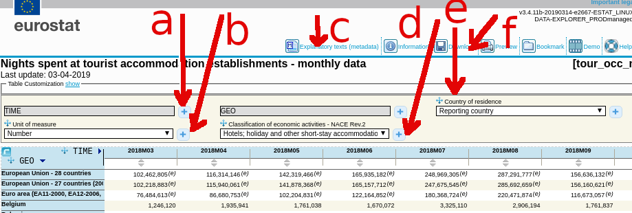

## Eurostat data
### Introduction

Tourism, in a statistical context, refers to the activity of visitors
taking a trip to a destination outside their usual environment, for
less than a year. It can be for any main purpose, including business
or leisure. (cf https://ec.europa.eu/eurostat/web/tourism)

Eurostat statistics on tourism statistics consist of two main components:

* Capacity and occupancy of tourist establishments (Supply Side)

* Tourism trips (Demand Side)

Capacity data refer notably to the number of establishments and the
number of bed places, while occupancy data refer to the number of
arrivals at accommodation establishments and the number of nights
spent. (cf https://ec.europa.eu/eurostat/web/tourism/data/database tour_indm/tour_inda)

Tourism trips (data) refer to the number of tourists and tourism trips
made. They are available broken down by main characteristics of the
trip, such as destination, duration, mode of transport used, or
expenditure, as well as by socio-demographic characteristics of the
tourists, such as age and gender.
(cf https://ec.europa.eu/eurostat/web/tourism/data/database tour_dem)

### Methodology resources (definitions/Measurement etc...)

* https://ec.europa.eu/eurostat/web/tourism/methodology

* https://ec.europa.eu/eurostat/web/products-manuals-and-guidelines/-/KS-GQ-14-013

### Key tables (EU)

a -- time (data frequency and span); b -- nunit of measure
c -- concepts and explanations; d -- what is counted; 
e -- foreign/local/total visitors; f -- download button

#### Monthly data

* Nights spent at tourist accommodation establishments
(http://appsso.eurostat.ec.europa.eu/nui/show.do?dataset=tour_occ_nim&lang=en)

* Arrivals at tourist accommodation establishments
(http://appsso.eurostat.ec.europa.eu/nui/show.do?dataset=tour_occ_arm&lang=en)

* Net occupancy rate of bed-places and bedrooms in hotels and similar accommodation
(http://appsso.eurostat.ec.europa.eu/nui/show.do?dataset=tour_occ_mnor&lang=en)

#### Annual data

* Occupancy of tourist accommodation establishments (tour_occ):	

* Nights spent by residents and non-residents (tour_occ_n)	

* Arrivals of residents and non-residents (tour_occ_a)	

* Occupancy rates for hotels and similar accommodation (tour_occ_or)	

* Capacity of tourist accommodation establishments (tour_cap)	

#### Other tables

* Annual enterprise data for selected tourism industries (tour_sbs)	

* Annual, monthly and quarterly enterprise data for selected tourism industries (tour_sts)

* Annual and quarterly data on employment for selected tourism industries (tour_lfs)

* Annual data on trips of EU residents (tour_dem) (demand side)

### NON EU-statistics

* https://ec.europa.eu/eurostat/web/european-neighbourhood-policy/background

* enp-east: Armenia, Azerbaijan, Belarus, Georgia, Moldova and Ukraine.
(https://ec.europa.eu/eurostat/web/european-neighbourhood-policy/enp-east/data/database)

* enp-south: Algeria, Egypt, Israel, Jordan, Lebanon, Libya,
Morocco, Palestine, Syria and Tunisia.
(https://ec.europa.eu/eurostat/web/european-neighbourhood-policy/enp-south/data/database)

## GUS (Polish Statistical Main Office) 

At GUS WWW page data is published as spreadsheets on yearly basis. There is
no access to the database (with some interface). Note however
that data from Eurostat on nights spent/arrivals/occupancy rate shoud be idenctical to data published by GUS (so no need to use GUS data.)

Tourism in 2017, 2016, 2015
(https://stat.gov.pl/en/topics/culture-tourism-sport/tourism/tourism-in-2017,1,15.html; https://stat.gov.pl/en/topics/culture-tourism-sport/tourism/tourism-in-2016,1,14.html; https://stat.gov.pl/en/topics/culture-tourism-sport/tourism/tourism-in-2015,1,13.html)

There is a separate interface to GUS data (BDL) but it mainly contains 
information on tourist infrastructure not traffic/usage.
(https://bdl.stat.gov.pl/BDL/dane/podgrup/temat)