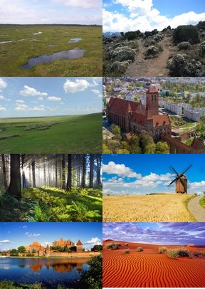

## Land cover in countries and regions

As I was unable to find definitions for various land covers at OECD 
database, I use Eurostat definitions, which lacks *sparse area* type.

**Artificial**
Artificial land
Built-up areas include roofed constructions (buildings) distinguished in categories by the

**Woodland**
Areas covered by trees with a tree crown area of at least 10%. 

**Water**
Areas covered by water and flooded surfaces or likely to be so over a large part of the year. 

**Wetland**
Wetlands are areas that fall between land and water. They are areas that are wet for long
enough periods that the plants and animals living in or near them are adapted to, and often
dependent on, wet conditions for at least part of their life cycle

**Cropland**
Arable land means crop production on a parcel. The recent crop must be classified according to
the nomenclature.

**Woodland**
Areas covered by trees with a tree crown area of at least 10%. 

**Shrubland**
Areas dominated (more than 20% of the surface) by shrubs and low woody plants 

**Grassland**
Land predominantly covered by communities of grassland, grass
like plants and shrubs. The density of tree-crown is less than 10%
and the density of tree+shrub-crown is less than 20%. 

**Bare land**
Areas with no dominant vegetation cover. 50% of the ground or more is bare. 

**Water**
Areas covered by water and flooded surfaces 
or likely to be so over a large part of the year.




## Land cover in countries and regions

```{r}
require(ggplot2)
library("dplyr")
library(RColorBrewer)
library(ggpubr)

# Bare;Cropland;Tree;Grassland;Shrubland;Sparse;Artificial;InlandWater;Wetland
mycolors <- c( '#e6550d', '#636363', '#31a354', '#e5f5e0', '#3182bd', '#feb24c', '#ffffb3', '#005a32', '#543005')

showBP <- function(country, cname) {
  p <- ggplot(d, aes(x = class, y=country, fill=class )) +
    geom_bar(stat="identity") +
    xlab(label="") + ylab(label="% ") +
    ##coord_cartesian(ylim = c(0, 60)) +
    scale_y_continuous(name="%", limits=c(0, 60)) +
    coord_flip()+ ggtitle(sprintf ("Share of land use %s", cname)) +
    theme(plot.title = element_text(hjust = 0.5)) +
    scale_fill_manual(values = mycolors) +
    geom_text(aes(label=sprintf ("%.1f", country)), hjust=-.08, color="black", size=3.0) +
    ###scale_color_discrete(guide=F) +
    theme(legend.position="none")

  return(p)
}

d <- read.csv("land_cover_2015_percent_byCountry.csv", sep = ';', dec = ".",  header=T, na.string="NA");

p1 <- showBP(d$Poland, 'PL');
p2 <- showBP(d$Uzbekistan, 'UZ');
p3 <- showBP(d$Germany, 'DE');
p4 <- showBP(d$France, 'FR');
p5 <- showBP(d$Spain, 'ES');
p6 <- showBP(d$Italy, 'IT');
p7 <- showBP(d$EU28, 'EU28');
p8 <- showBP(d$World, 'World');

ggarrange(p1, p2, p3, p4,  ncol = 2, nrow = 2)
```

```{r echo=T}
ggarrange(p5, p6, p7, p8, ncol=2, nrow=2)
```

## Source

[OECD](https://stats.oecd.org/Index.aspx?DataSetCode=LAND_COVER)

[Land cover overview by NUTS 2 regions](http://appsso.eurostat.ec.europa.eu/nui/show.do?dataset=lan_lcv_ovw&lang=en)

[Lucas209](https://ec.europa.eu/eurostat/documents/205002/208938/LUCAS2009_C3-Classification_20121004.pdf/02799df4-35dd-43a9-9e93-8e0aa0923ad1)
